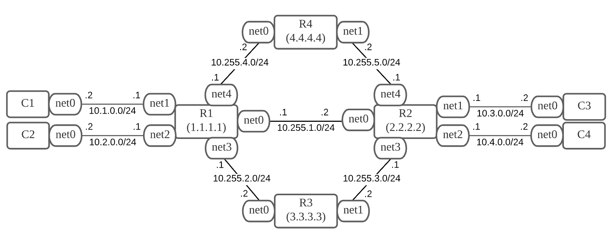

## IP Routing Hands-on

## 本講義で採用する三種類のNetwork Topology

大きく分けて２種類のnetworkが存在することを想定してください.

- user-net:
	- user-net1(un1): 10.1.0.0/24
	- user-net2(un2): 10.2.0.0/24
	- user-net3(un3): 10.3.0.0/24
	- user-net4(un4): 10.4.0.0/24
- core-net:
	- core-net1(cn1): 10.255.1.0/24
	- core-net2(cn2): 10.255.2.0/24
	- core-net3(cn3): 10.255.3.0/24
	- core-net4(cn4): 10.255.4.0/24
	- core-net5(cn5): 10.255.5.0/24

## topo2
cn1が死ぬと un1,un3等が接続できなくなる.


## topo3
cn1が死んでもcn2,3でbackup pathが用意できる.


## topo4
cn2,3のpathとcn4,5の2つbackup pathが用意できる.


## topo5


## 演習: Static Routing Configuration

上記topo2,3,4をnetnsで構成し, すべてstatic routeで通信できるようにしてみましょう.
以下を参考にしてください.

```
## Add route
ip route add 10.99.0.0/24 via 10.0.0.2
ip route add 10.99.0.0/24 nexthop via 10.0.0.2 nexthop via 10.0.0.3

## Del route
ip route del 10.99.0.0/24
```
