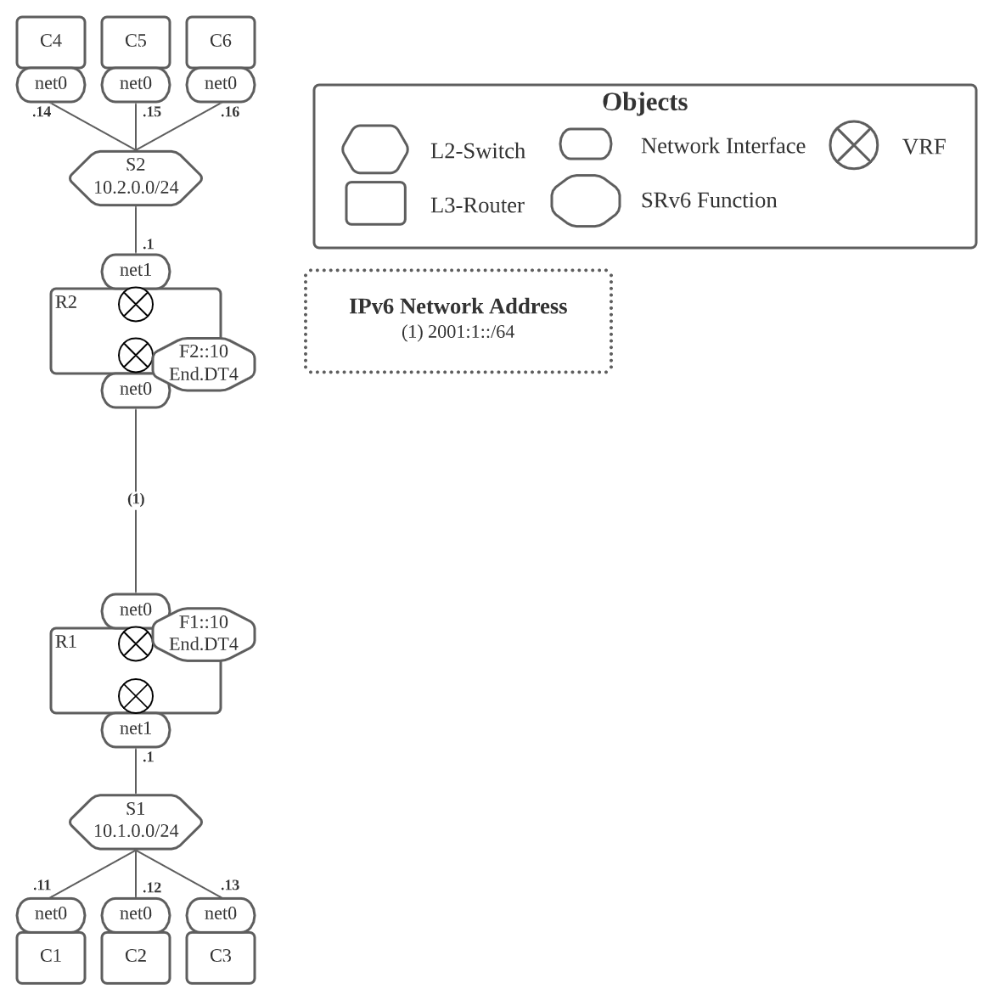

# SRv6 Configuration Hands-on

## (1) 以下のNetwork構成をNetwork Namespaceで作成してください



## (2) SRv6のL3 VPNを設定してください

上記で構成したNetworkに対して, R1, R2 でL3VPNを構成してください.
SRv6の設定に関しては以下を参考に行ってください

基本的な設定
```
ip netns exec R1 ip link add vrf10 type vrf table 10
ip netns exec R1 ip link set vrf10 up
ip netns exec R1 ip link set net1 vrf vrf10
ip netns exec R1 ip link set net1 up

ip netns exec R1 ip addr add 2001:1::1/64 dev net0
ip netns exec R1 ip addr add 10.1.0.1/24 dev net1
```

H.Encapに関して
```
ip netns exec R1 ip route add 10.2.0.0/24 encap seg6 mode segs f2::10 dev net0 vrf vrf10
```

End.DT4に関して
```
ip netns exec R1 ip route add 169.254.0.10 dev vrf10
ip netns exec R1 ip route add f1::10 encap seg6local action End.DX4 nh4 169.254.0.10 dev vrf10
```

設定後は以下のCLIを実行して, 正しくSRv6 VPNが設定されていることを確認してください
```
ip netns exec C1 ping -c1 10.2.0.14
ip netns exec C1 ping -c1 10.2.0.15
ip netns exec C1 ping -c1 10.2.0.16
ip netns exec C2 ping -c1 10.2.0.14
ip netns exec C2 ping -c1 10.2.0.15
ip netns exec C2 ping -c1 10.2.0.16
ip netns exec C3 ping -c1 10.2.0.14
ip netns exec C3 ping -c1 10.2.0.15
ip netns exec C3 ping -c1 10.2.0.16
```
